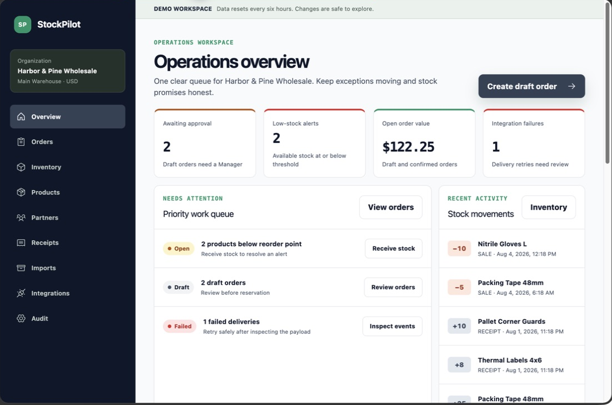
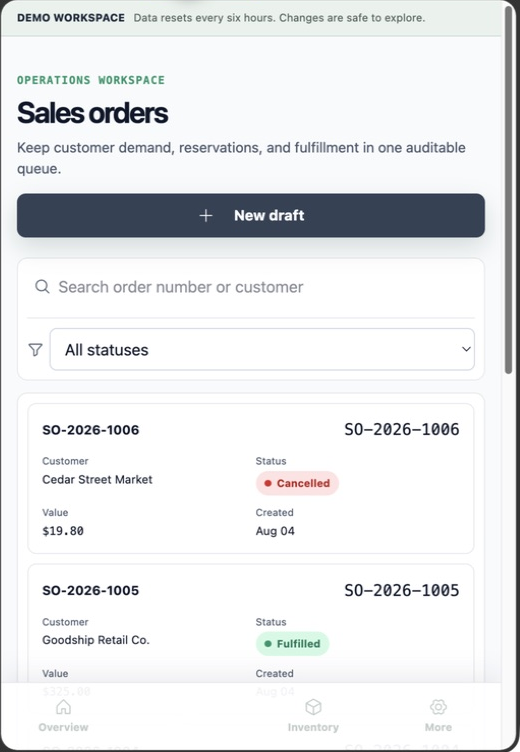
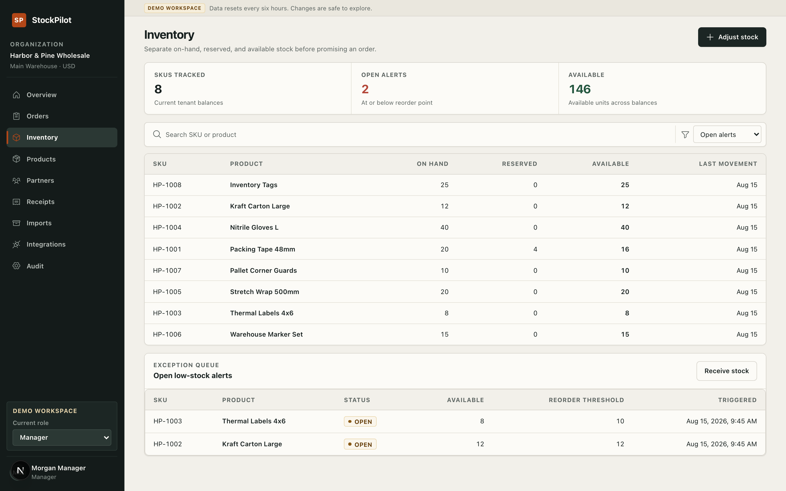
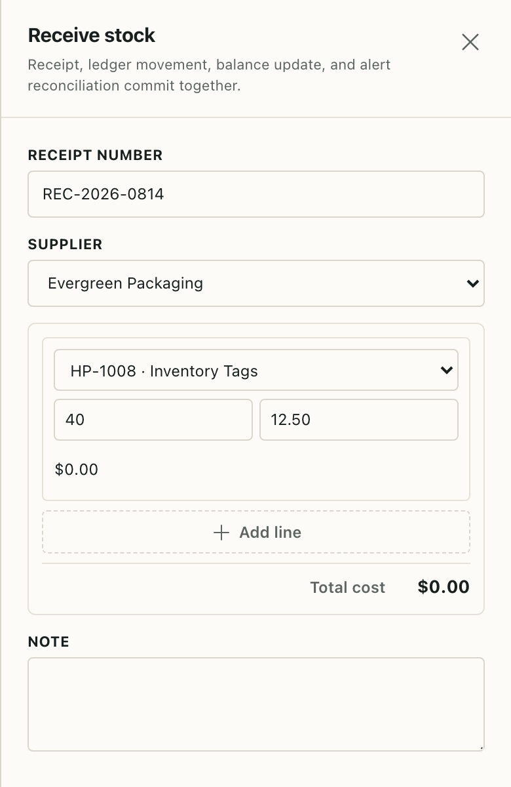
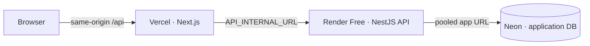

# StockPilot

[](https://github.com/longhang2004/StockPilot/actions/workflows/ci.yml)
[](https://stock-pilot-web-five.vercel.app)
[](LICENSE)

StockPilot is a multi-tenant inventory and B2B order operations workspace for
small wholesale teams. It gives an operations manager one calm queue for
receiving stock, preventing overselling, and fulfilling customer orders.

[Live demo](https://stock-pilot-web-five.vercel.app) ·
[API docs](https://stockpilot-api-y1aw.onrender.com/docs) ·
[Walkthrough](docs/walkthrough.md) ·
[Architecture](docs/architecture.md)

> **Portfolio demo:** the current deployment uses a temporary Vercel origin,
> Render Free, Neon Free, and UptimeRobot. Before launch, replace the demo
> links with the chosen custom domain and set the same origin as `SITE_URL`.
> The project is intentionally designed to demonstrate product and engineering
> decisions, not to provide a production SLA.

## Product at a glance

- **One operational work queue** — approvals, low-stock exceptions, failed
  integrations, open-order value, and recent activity in one overview.
- **Inventory you can trust** — an append-only movement ledger projected into
  balances, with `on_hand >= reserved >= 0` enforced at the database boundary.
- **Safe B2B order flow** — draft, confirm, fulfill, and cancel transitions
  with price snapshots and deterministic row locks against overselling.
- **Demoable reliability** — tenant isolation, RBAC, atomic writes, idempotency,
  webhook deduplication, CSV partial-valid imports, and a canonical reset.

## Screenshots

These images were captured from the current seeded demo deployment on 4 August 2026. They are cropped to the application viewport so the UI, rather than
browser chrome, is the focus.

| Overview · desktop                                                  | Orders · mobile                                                  |
| ------------------------------------------------------------------- | ---------------------------------------------------------------- |
|  |  |

| Inventory · desktop                                                 | Receive stock · mobile drawer                                              |
| ------------------------------------------------------------------- | -------------------------------------------------------------------------- |
|  |  |

## Core workflows

1. **Receive stock:** apply a receipt and update the balance projection and
   movement ledger in one transaction.
2. **Prepare an order:** create a Draft with customer, SKU, product-name, and
   unit-price snapshots.
3. **Protect availability:** a Manager confirms the Draft; sorted balance-row
   locks reserve stock atomically and reject overselling.
4. **Fulfill safely:** Staff fulfills the Confirmed order; `SALE` movements,
   `on_hand`, and `reserved` change together.
5. **Handle exceptions:** retry a failed integration, preview a CSV with
   row-level errors, and use Audit to trace important mutations.

## Demo roles

| Role        | What to show                                     | Write boundary                                        |
| ----------- | ------------------------------------------------ | ----------------------------------------------------- |
| **Owner**   | Team view, settings, canonical reset             | Organization settings and demo reset                  |
| **Manager** | Receipt → confirm → audit, imports, integrations | Catalog, receipts, adjustments, and order transitions |
| **Staff**   | Orders and inventory on desktop/mobile           | Draft orders and fulfillment of Confirmed orders      |

All demo accounts use `StockPilotDemo!` for credential login. The landing page
also provides one-click role entry.

| Role    | Email                                     |
| ------- | ----------------------------------------- |
| Owner   | `owner@stockpilot-demo.stockpilot.test`   |
| Manager | `manager@stockpilot-demo.stockpilot.test` |
| Staff   | `staff@stockpilot-demo.stockpilot.test`   |

The canonical fixture contains 8 active products plus one inactive product, 5
customers, 3 suppliers, matching receipt/ledger rows, two low-stock alerts,
six orders across the state machine, one failed integration delivery, and one
partial CSV import. It is reseeded idempotently on first deploy and after the
six-hour Owner/automatic reset.

## Architecture



StockPilot is a modular monolith in a pnpm workspace:

```text
apps/web              Next.js 16 / React 19 UI
apps/api              NestJS 11 / Prisma 7 API and optional pg-boss worker
packages/contracts    Zod schemas and generated API contracts
infra/postgres        Local role bootstrap and production provisioning SQL
docs                  Deployment, operations, threat model, ERD, test report
```

The API owns tenant context, RBAC, transaction boundaries, RLS setup, the stock
ledger, optional queue scheduling, and RFC 9457 problem details. The browser
never supplies an organization id that decides authorization.

## Local development

### Prerequisites

- Node.js 24 LTS
- pnpm 10.13.1
- Docker Desktop or another Docker Compose-compatible runtime

```bash
cp .env.example .env
pnpm install
docker compose up -d postgres
pnpm db:generate
pnpm db:migrate
pnpm db:seed
pnpm dev
```

The web app runs at `http://localhost:3000`. The API, readiness check, and
OpenAPI UI run at `http://localhost:4000/v1/health/live`,
`http://localhost:4000/v1/health/ready`, and `http://localhost:4000/docs`.

## Verification

```bash
pnpm format:check
pnpm lint
pnpm typecheck
pnpm typecheck:e2e
pnpm test:unit
pnpm --filter @stockpilot/api test:unit:coverage
pnpm --filter @stockpilot/api test:integration
pnpm test:e2e
pnpm build
```

The integration and browser gates need PostgreSQL. CI provisions a clean
database, applies migrations, seeds the canonical fixture, and runs every
gate. Without Docker, unit, lint, typecheck, and build gates can still run.

## API surface

The versioned API is under `/v1`:

- **Auth:** `/auth/login`, `/auth/demo-login`, `/auth/session`, `/auth/csrf`
- **Catalog:** `/products`, `/customers`, `/suppliers`
- **Inventory:** `/inventory/balances`, `/inventory/movements`,
  `/inventory/adjustments`, `/receipts`
- **Orders:** `/orders`, `/orders/:id/confirm`, `/orders/:id/fulfill`,
  `/orders/:id/cancel`
- **Operations:** `/dashboard/overview`, `/alerts`, `/audit-events`
- **Integrations:** `/webhooks/mock-storefront/orders`,
  `/integration-deliveries/:id/retry`
- **Health/docs:** `/health/live`, `/health/ready`, `/docs`, `/openapi.json`

State-changing receipts, adjustments, order transitions, import commits,
integration retries, and demo resets require an `Idempotency-Key`. Reusing a
key with the same payload replays the original response; a different payload
returns `409`.

## Trust model

- Session tokens are opaque 32-byte values; only their SHA-256 hashes are stored.
- Passwords use Argon2id. Production cookies are HttpOnly, Secure, and
  SameSite=Lax; browser writes require a trusted Origin and CSRF token.
- The runtime database role is `NOBYPASSRLS`; migration and queue roles are
  separate. Ledger and audit tables revoke update/delete privileges.
- Stock-changing writes are transactional. `available` is always
  `on_hand - reserved`, and negative states are rejected by both application
  and database constraints.
- Webhook delivery ids and command idempotency records prevent duplicate Draft
  orders and partial mutations.

## Public demo topology

| Layer     | Free-tier service                       | Responsibility                              |
| --------- | --------------------------------------- | ------------------------------------------- |
| Web       | [Vercel](https://vercel.com/)           | Next.js app and same-origin `/api` proxy    |
| API       | [Render](https://render.com/)           | NestJS API, migrations, and optional worker |
| Database  | [Neon](https://neon.tech/)              | Application PostgreSQL; queue DB is opt-in  |
| Keep-warm | [UptimeRobot](https://uptimerobot.com/) | Periodic health checks for the Render demo  |

The default free profile sets `QUEUE_REQUIRED=false` and leaves pg-boss
disabled so Neon Free compute is not consumed by an always-on poller. Manual
integration retry remains available; automatic retry and scheduled
reconciliation are opt-in queue-profile features.

## Documentation map

| Document                                           | Use it for                                         |
| -------------------------------------------------- | -------------------------------------------------- |
| [Architecture and data flow](docs/architecture.md) | Boundaries, tenant context, and transactions       |
| [Deployment runbook](docs/deployment.md)           | Provider settings, releases, rollback, and secrets |
| [Operations guide](docs/operations.md)             | Health, logs, queue failures, reset, and incidents |
| [Threat model](docs/threat-model.md)               | Security assumptions and mitigations               |
| [Entity relationship diagram](docs/erd.md)         | Data model and invariants                          |
| [Verification report](docs/test-report.md)         | CI, live smoke checks, and acceptance matrix       |
| [Two-minute walkthrough](docs/walkthrough.md)      | A reviewer-ready product tour                      |
| [Screenshot notes](docs/assets/README.md)          | Capture provenance and asset rules                 |

## Scope

Included: one warehouse, catalog and partners, receipts, inventory ledger,
B2B orders, CSV imports, mock storefront webhooks, audit, RBAC, RLS, signup
and workspace creation, invitation-based team management, workspace
switching, Starter/Pro Stripe subscriptions with server-side entitlements,
operational analytics, and responsive operations workflows.

Out of scope: tax, debt, returns, purchase orders, partial
receiving/fulfillment, variants, barcodes, lot/serial tracking, valuation,
multiple warehouses, Redis, marketplace integrations, and production SLA
commitments.

## License

[MIT](LICENSE) © 2026 `longhang2004`.
