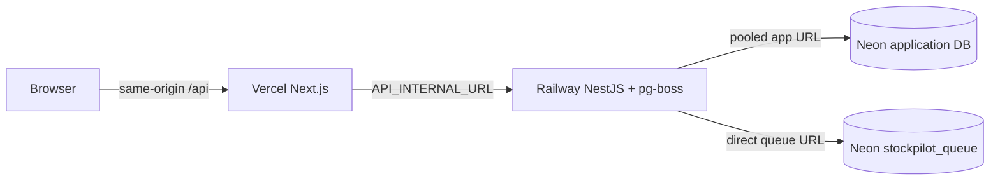

# StockPilot

[](https://github.com/longhang2004/StockPilot/actions/workflows/ci.yml)

StockPilot is a multi-tenant inventory and B2B order operations SaaS for small
wholesale teams. It gives an operations manager one calm work queue for
receiving stock, preventing overselling, and fulfilling customer orders.

**Live demo:** provider provisioning is the remaining external step. The
production topology and release runbook are ready; Vercel/Railway/Neon OAuth
and billing require the account owner's approval. Once deployed, put the
canonical Vercel URL here and in [`docs/walkthrough.md`](docs/walkthrough.md).

**API docs:** the production `/docs` and `/openapi.json` links are added beside
the live URL after the first Railway deployment; the local API docs are
available at `http://localhost:4000/docs`.

## Why this project

The differentiator is reliability that is visible in ordinary workflows:

- every tenant query is session-scoped and enforced again by forced PostgreSQL
  RLS;
- stock is an append-only ledger projected into balances, with
  `on_hand >= reserved >= 0` and deterministic row locks against overselling;
- receipt, order transition, webhook, import commit, and demo reset operations
  are atomic and idempotent;
- the responsive UI keeps the same receipt-to-fulfillment path usable on a
  phone at a warehouse counter.

## Architecture



This is a modular monolith in a pnpm workspace:

```text
apps/web              Next.js 16 / React 19 UI
apps/api              NestJS 11 / Prisma 7 API and worker
packages/contracts    Zod schemas and generated API contracts
infra/postgres        local role bootstrap and production provisioning SQL
docs                  deployment, operations, threat model, ERD, test report
```

The API owns tenant context, RBAC, transactions, RLS setup, the stock ledger,
pg-boss scheduling, and RFC 9457 problem details. The browser never sends an
organization id that decides authorization.

## Demo role matrix

| Role    | Typical demo path                                | Write boundary                                    |
| ------- | ------------------------------------------------ | ------------------------------------------------- |
| Owner   | team view, settings, canonical reset             | organization settings and demo reset              |
| Manager | receipt → confirm → audit, imports, integrations | catalog, receipts, adjustments, order transitions |
| Staff   | orders and inventory on desktop/mobile           | draft orders and fulfillment of confirmed orders  |

All demo accounts use `StockPilotDemo!` for credential login; the web app also
offers one-click role entry.

| Role    | Email                                     |
| ------- | ----------------------------------------- |
| Owner   | `owner@stockpilot-demo.stockpilot.test`   |
| Manager | `manager@stockpilot-demo.stockpilot.test` |
| Staff   | `staff@stockpilot-demo.stockpilot.test`   |

The canonical demo fixture includes 8 active products plus one inactive product,
5 customers, 3 suppliers, matching receipt/ledger rows, 2 low-stock alerts,
2 Draft orders, 1 Confirmed order, 2 Fulfilled orders, 1 Cancelled order, a
failed integration delivery, and a partial CSV import preview. It is reseeded
idempotently on first deploy and after the six-hour Owner/automatic reset.

## Local development

### Prerequisites

- Node.js 24 LTS
- pnpm 10.13.1
- Docker Desktop or another Docker Compose-compatible runtime

```bash
cp .env.example .env
pnpm install
docker compose up -d postgres
pnpm db:generate
pnpm db:migrate
pnpm db:seed
pnpm dev
```

The web app runs at `http://localhost:3000`; the API, readiness check, and
OpenAPI UI are at `http://localhost:4000/v1/health/live`,
`http://localhost:4000/v1/health/ready`, and `http://localhost:4000/docs`.

## Verification

```bash
pnpm format:check
pnpm lint
pnpm typecheck
pnpm typecheck:e2e
pnpm test:unit
pnpm --filter @stockpilot/api test:unit:coverage
pnpm --filter @stockpilot/api test:integration
pnpm test:e2e
pnpm build
```

The integration and browser gates need PostgreSQL. CI provisions a clean
database, applies migrations, seeds the canonical fixture, and runs every
gate. A local run with no database can still execute the unit, lint, typecheck,
and build gates.

## API surface

The versioned API is under `/v1`. Health checks are `/v1/health/live` and
`/v1/health/ready`; interactive OpenAPI is at `/docs` and JSON is at
`/openapi.json`.

Important routes include `/v1/products`, `/v1/customers`, `/v1/suppliers`,
`/v1/inventory/balances`, `/v1/inventory/movements`, `/v1/receipts`,
`/v1/orders`, `/v1/dashboard/overview`, `/v1/alerts`,
`/v1/product-imports/preview`, `/v1/webhooks/mock-storefront/orders`,
`/v1/integration-deliveries`, `/v1/organization/settings`, `/v1/team`, and
`/v1/organization/demo-reset`.

Every state-changing receipt, adjustment, order transition, import commit,
integration retry, and demo reset requires an `Idempotency-Key`. Reusing a key
with the same payload replays the original response; a different payload gets
`409`.

## Security and invariants

- Opaque 32-byte session tokens are stored only as SHA-256 hashes.
- Passwords use Argon2id; cookies are HttpOnly, Secure in production, and
  SameSite=Lax.
- Browser writes require a trusted Origin and a per-session CSRF token.
- Runtime database role is `NOBYPASSRLS`; migration and queue roles are
  separate. Ledger and audit tables revoke update/delete privileges.
- All stock-changing writes happen in one transaction. `available` is always
  `on_hand - reserved`; the database and application reject negative states.
- Webhook delivery IDs and command idempotency records prevent duplicate Draft
  orders or partial mutations.

## Portfolio documentation

- [Architecture and data flow](docs/architecture.md)
- [Production deployment runbook](docs/deployment.md)
- [Operations and incident guide](docs/operations.md)
- [Threat model](docs/threat-model.md)
- [Entity relationship diagram](docs/erd.md)
- [Verification and test report](docs/test-report.md)
- [Two-minute walkthrough](docs/walkthrough.md)

## Deployment status

The version-controlled infrastructure is ready:

- [`railway.json`](railway.json) builds the API Dockerfile, runs migration plus
  idempotent seed, checks readiness, and restarts on failure.
- [`apps/web/vercel.json`](apps/web/vercel.json) configures the Next.js workspace
  build.
- [`infra/postgres/provision-production.sql`](infra/postgres/provision-production.sql)
  creates parameterized Neon runtime/queue roles and emits RLS verification
  queries.

Creating the provider projects, accepting Railway/Neon billing, and authorizing
GitHub/Vercel/Railway/Neon are intentionally not automated from this repository.
After those approval boundaries, follow the first-deployment sequence in
[`docs/deployment.md`](docs/deployment.md), capture stable Overview/Orders/
Inventory/receipt screenshots, and add their paths to the walkthrough.
