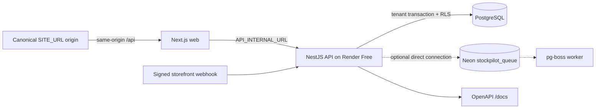

# StockPilot architecture

StockPilot is a modular monolith. The web app talks to the API through a
same-origin `/api` rewrite, while the API owns transactions, authorization,
RLS context, and the PostgreSQL ledger.

The API uses a pooled Neon URL for application traffic and a direct migration
URL for Prisma release commands. A separate direct queue URL can be supplied
for pg-boss, but the selected zero-cost demo profile intentionally leaves it
unset (`QUEUE_REQUIRED=false`) so an always-on polling worker does not consume
Neon Free compute hours. Manual integration retries remain synchronous; the
automatic retry and scheduled reconciliation jobs are enabled only for a short
queue-enabled acceptance run. The free-tier deployment uses a GitHub Actions
migration/seed gate while Render auto-deploys commits on `main`; an optional
Render deploy hook can be used for an explicit rollout because Render Free does
not provide the paid-service pre-deploy command.

Every tenant mutation follows the same shape:

1. Resolve organization and actor from the session (or signed integration
   destination), never from a client-supplied organization id.
2. Set `app.current_org_id` and `app.current_actor_id` in a transaction.
3. Lock balance rows in sorted product-id order when stock can change.
4. Write the projection and append-only movement/audit records atomically.
5. Store the idempotent response under a stable payload fingerprint.

Stock-changing mutations call the low-stock reconciliation service in the same
transaction. When the queue profile is enabled, a scheduled pg-boss job
periodically locks and reconciles every balance so an alert cannot remain stale
after an out-of-band repair. The
dashboard and Owner settings/team screens are read models over the same
tenant-scoped transaction boundary; they never accept organization identity
from the browser.

The observability boundary is deliberately small: a request interceptor emits
structured JSON with trace, actor, organization, method, route, status, and
duration metadata; the redaction utility masks cookies, authorization values,
CSRF tokens, webhook signatures, and credential-bearing URLs before logging.
Sentry is optional and receives only the redacted exception context.

The database is authoritative for `on_hand`, `reserved`, and the movement
ledger. `available` is always computed as `on_hand - reserved`; no UI value is
allowed to become a second source of truth.

The public demo is seeded with deterministic, organization-scoped fixture IDs.
The first deploy only seeds an empty demo organization; Owner and automatic
six-hour reset use the same fixture after deleting operational rows, then write
the reset audit event and next-reset schedule in the same transaction.
