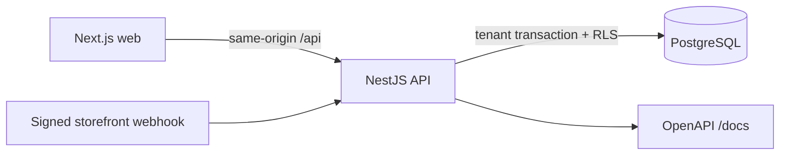

# StockPilot architecture

StockPilot is a modular monolith. The web app talks to the API through a
same-origin `/api` rewrite, while the API owns transactions, authorization,
RLS context, and the PostgreSQL ledger.

Every tenant mutation follows the same shape:

1. Resolve organization and actor from the session (or signed integration
   destination), never from a client-supplied organization id.
2. Set `app.current_org_id` and `app.current_actor_id` in a transaction.
3. Lock balance rows in sorted product-id order when stock can change.
4. Write the projection and append-only movement/audit records atomically.
5. Store the idempotent response under a stable payload fingerprint.

The database is authoritative for `on_hand`, `reserved`, and the movement
ledger. `available` is always computed as `on_hand - reserved`; no UI value is
allowed to become a second source of truth.
