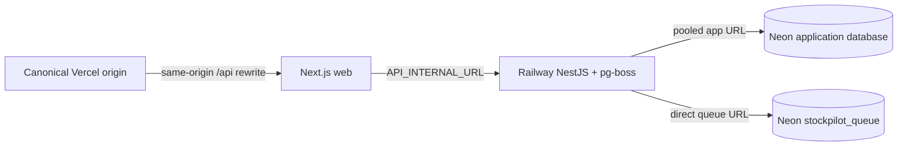

# StockPilot production deployment runbook

This is the production-shaped portfolio topology:



The public demo uses the default Vercel domain. Preview deployments are not
functional demos because the API trusts one canonical `WEB_ORIGIN` for CSRF.
Custom domains and Sentry are optional follow-up work.

## Provider settings

### Vercel

- Import `longhang2004/StockPilot` and set **Root Directory** to `apps/web`.
- Enable Vercel's **Include source files outside of the Root Directory** option
  so the workspace lockfile and `packages/contracts` are available to the
  build.
- Keep **Framework Preset** as Next.js and use Node.js 24 in project settings.
- The checked-in [`apps/web/vercel.json`](../apps/web/vercel.json) runs the
  contracts build before the web build and installs the workspace lockfile.
- Set `API_INTERNAL_URL` to the Railway public API URL and `NODE_ENV=production`.
- Do not expose `API_INTERNAL_URL` as a client-side variable. The rewrite keeps
  browser requests on the Vercel origin so session cookies and CSRF checks are
  same-origin.

### Railway

- Create one service from `main` and keep the repository root as the build
  context. Railway reads [`railway.json`](../railway.json).
- The service builds `apps/api/Dockerfile`, runs migrations and the idempotent
  seed as a pre-deploy command, starts the API/worker, checks
  `/v1/health/ready`, and restarts on failure up to ten times.
- This is one long-running API + pg-boss service; no second worker service is
  needed. Generate a Railway public domain after the first healthy deploy and
  use that URL as Vercel's `API_INTERNAL_URL`.
- Leave **Serverless/app sleeping disabled** for this demo. The pg-boss worker
  and scheduled reconciliation are intended to stay available continuously.
- Generate secrets in Railway's secret store. Do not commit them or paste them
  into a deployment log.

#### Railway cost and cold-start policy

- Railway's Free plan includes $1 of monthly resource credit. Hobby is $5/month
  and that subscription includes $5 of resource usage; usage beyond that
  credit is billed at the published CPU/RAM/egress rates. An active paid
  subscription and payment method are required for the Hobby deployment.
- A normal persistent Railway service does not intentionally sleep, so this
  topology has no periodic cold start. Railway's optional **Serverless** mode
  can stop an inactive service after roughly ten minutes without outbound
  traffic; the first request after it sleeps has a cold-boot delay. Database
  connections or worker traffic can prevent sleep, but we do not rely on that
  behavior for correctness.
- Keep Serverless off for the public demo. If cost pressure makes it necessary
  later, measure queue latency and first-request latency before enabling it, and
  keep the `/v1/health/ready` smoke check in the release checklist.
- Configure a low usage alert and hard limit in Railway. A hard limit protects
  the budget by stopping workloads when the configured usage ceiling is hit.

### Neon

- Create the project in the region closest to Railway (Singapore/Asia when
  available).
- Run [`infra/postgres/provision-production.sql`](../infra/postgres/provision-production.sql)
  with a direct migration connection and psql variables for both passwords.
- Apply Prisma migrations through the direct migration URL. The runtime API
  uses a pooled `stockpilot_app` URL; pg-boss uses a direct URL to the separate
  `stockpilot_queue` database.
- Confirm `stockpilot_app` has `rolbypassrls=false`, is not a member of
  `neon_superuser`, and that tenant tables have both RLS and forced RLS.

## Environment matrix

| Variable                 | Vercel             | Railway                       | Notes                                            |
| ------------------------ | ------------------ | ----------------------------- | ------------------------------------------------ |
| `API_INTERNAL_URL`       | Railway public URL | —                             | Production-only rewrite target.                  |
| `DATABASE_URL`           | —                  | pooled `stockpilot_app` URL   | Runtime queries only.                            |
| `MIGRATION_DATABASE_URL` | —                  | direct migration URL          | Pre-deploy and seed only; do not use at runtime. |
| `QUEUE_DATABASE_URL`     | —                  | direct `stockpilot_queue` URL | pg-boss worker database.                         |
| `QUEUE_REQUIRED`         | —                  | `true`                        | Readiness is 503 until pg-boss starts.           |
| `WEB_ORIGIN`             | —                  | exact Vercel origin           | No trailing slash; one canonical origin.         |
| `NODE_ENV`               | `production`       | `production`                  | Enables secure cookies and production behavior.  |
| `DEMO_MODE`              | —                  | `true`                        | Enables one-click demo accounts.                 |
| `DEMO_ORGANIZATION_SLUG` | —                  | `stockpilot-demo`             | Canonical demo tenant.                           |
| `CSRF_SECRET`            | —                  | generated secret (32+ chars)  | Rotate in Railway secret storage.                |
| `WEBHOOK_SIGNING_SECRET` | —                  | generated secret (16+ chars)  | Share only with the signed sender.               |
| `SESSION_COOKIE_NAME`    | —                  | `stockpilot_session`          | Change to expire all existing cookies.           |
| `SENTRY_DSN`             | —                  | optional                      | Leave empty when Sentry is not configured.       |

## First deployment order

1. Create the Vercel project and record its canonical production origin.
2. Create the Neon project, provision roles and `stockpilot_queue`, then apply
   migrations with the direct migration URL.
3. Run the seed once. It creates identities and the canonical fixture only when
   the demo organization has no operational data.
4. Create the Railway service from `main`, set the environment matrix, and
   deploy. Wait for migrations, seed, and readiness to finish.
5. Set Railway's public URL as Vercel `API_INTERNAL_URL` and redeploy Vercel.
6. Run the smoke checklist below from the production origin.
7. Enable auto-deploy from `main`; require CI, block force-pushes and branch
   deletion, and keep the default branch as `main`.

The Railway and Neon Hobby/Launch billing steps are approval boundaries. Do not
enable billing or accept provider OAuth on behalf of the project owner.

## Routine release

1. Merge a reviewed change to protected `main` after CI is green.
2. Railway builds the Docker image and runs `prisma migrate deploy` followed by
   the idempotent seed before swapping traffic.
3. Confirm readiness, queue scheduling, and the release log. Vercel then builds
   the web project from the same commit.
4. Run the smoke paths that touch the changed area and record the release URL
   in the test report.

## Migration failure, rollback, and restore

- A non-zero pre-deploy command prevents promotion. Read the failed migration
  log and fix it in a reviewed migration; never mark `_prisma_migrations`
  manually.
- For an application regression, roll Railway and Vercel back to the previous
  known-good commit. Do not roll back a schema migration unless the migration
  explicitly includes a safe backwards-compatible down path.
- For database corruption or accidental data loss, create a Neon point-in-time
  restore/branch, apply migrations using the direct migration URL, run the role
  and ledger verification queries, then point Railway to the restored pooled
  URL.
- Restore queue data separately when needed. pg-boss jobs are retryable; a
  duplicate integration delivery must remain deduplicated by its external ID.

## Production smoke checklist

```bash
curl -fsS "$API_URL/v1/health/live"
curl -fsS "$API_URL/v1/health/ready"
curl -fsS "$API_URL/docs" >/dev/null
curl -fsS "$API_URL/openapi.json" >/dev/null
```

Then verify through the canonical Vercel origin:

- one-click Owner, Manager, and Staff login;
- Manager receipt and order confirmation;
- Staff fulfillment and the resulting sale movement;
- duplicate webhook creates one Draft order;
- Owner reset recreates the canonical fixture;
- Secure/HttpOnly/SameSite cookies and CSRF through `/api`;
- failed integration retry is accepted by pg-boss and reconciliation is
  scheduled;
- runtime role cannot bypass RLS or update/delete ledger rows;
- desktop/mobile screenshots and axe smoke remain green.

## Cost and safety guardrails

Use Railway Hobby and Neon usage billing only after the account owner approves
the payment boundary. Review usage after one week and pause the public service
if the demo is no longer needed. Vercel Hobby is sufficient for the personal
portfolio web project; a custom domain, Sentry DSN, and narrated video are
optional.

Official provider references: [Railway config as code](https://docs.railway.com/config-as-code/reference),
[Railway health checks](https://docs.railway.com/deployments/healthchecks),
[Railway pricing](https://docs.railway.com/pricing/plans),
[Railway Serverless](https://docs.railway.com/deployments/serverless),
[Railway cost control](https://docs.railway.com/pricing/cost-control),
[Neon pooling](https://neon.com/docs/connect/connection-pooling), and
[Neon role behavior](https://neon.com/docs/reference/compatibility).
