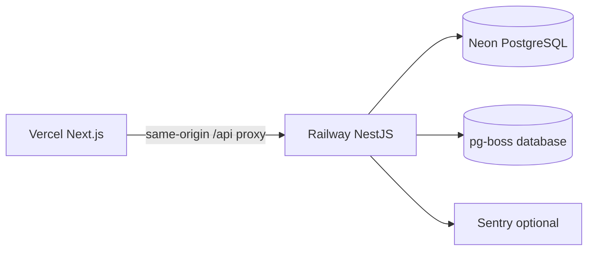

# StockPilot deployment runbook

This is the smallest production-shaped deployment for the portfolio demo:



## Local release rehearsal

1. Copy `.env.example` to `.env` and replace every placeholder secret.
2. Start PostgreSQL with `docker compose up -d postgres`.
3. Generate the Prisma client, apply migrations, and seed the demo:

   ```bash
   pnpm db:generate
   pnpm --filter @stockpilot/api exec prisma migrate deploy
   pnpm db:seed
   ```

4. Run `pnpm build` and start the API and web apps with `pnpm dev`.
5. Verify `GET /v1/health/live`, `GET /v1/health/ready`, login, receipt,
   confirm, fulfill, duplicate webhook, and Owner reset flows.

## Vercel web

- Root directory: repository root.
- Build command: `pnpm --filter @stockpilot/contracts build && pnpm --filter @stockpilot/web build`.
- Output: Next.js standalone/server output from the web app.
- Environment variables: `API_INTERNAL_URL` (Railway API URL) and
  `NODE_ENV=production`.
- Configure the Vercel domain as `WEB_ORIGIN` on Railway. The Next.js rewrite
  keeps browser API calls same-origin so the session cookie and CSRF checks are
  consistent.

## Railway API and worker

Use one Railway service for the API and pg-boss worker. The API module starts
the worker only when `QUEUE_DATABASE_URL` is present, which keeps local
development deterministic. A release command should be:

```bash
pnpm --filter @stockpilot/api exec prisma migrate deploy
pnpm --filter @stockpilot/api prisma:seed
```

The start command is `pnpm --filter @stockpilot/api start`. Set:

- `DATABASE_URL`: application role with `NOBYPASSRLS`.
- `MIGRATION_DATABASE_URL`: migration-only role, used only by the release step.
- `QUEUE_DATABASE_URL`: dedicated pg-boss database or role.
- `WEB_ORIGIN`: exact Vercel origin, without a trailing slash.
- `CSRF_SECRET`, `WEBHOOK_SIGNING_SECRET`, and `SESSION_COOKIE_NAME`.
- `DEMO_MODE` and `DEMO_ORGANIZATION_SLUG` for the public portfolio demo.
- `SENTRY_DSN` optionally; leave it blank to keep error reporting disabled.

Keep the migration role out of the runtime environment after deployment. Do
not grant `BYPASSRLS` to the API role. Use managed secret storage for all
values containing credentials or signing material.

## Neon PostgreSQL

Create the application role and grants from `infra/postgres/init.sql` before
the first migration. Run migrations against the migration URL, then verify
that the runtime URL can read and write tenant data but cannot bypass RLS.
The API depends on PostgreSQL extensions and row-level policies created by the
Prisma migrations; do not edit production tables manually.

## Smoke checklist

- `/v1/health/live` returns `200` without database access.
- `/v1/health/ready` returns `200` only after database and queue dependencies
  are ready.
- Three demo accounts resolve to one organization with distinct roles.
- A receipt changes balance and ledger together.
- Two concurrent confirmations cannot reserve more than available stock.
- Replaying a webhook delivery does not create a second order.
- Logs contain trace/actor/organization metadata but redact cookies, tokens,
  URLs with credentials, CSRF values, and webhook signatures.
- The Vercel domain can complete a login and state-changing request through the
  same-origin `/api` rewrite.
