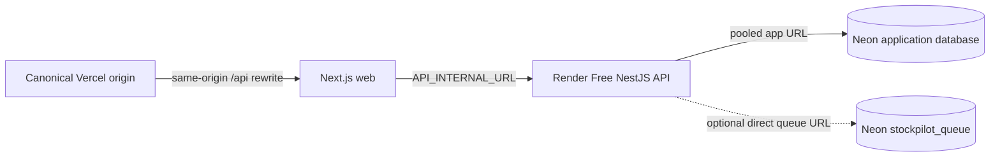

# StockPilot demo deployment runbook

This is the production-shaped portfolio topology:



The public demo uses the default Vercel domain. Preview deployments are not
functional demos because the API trusts one canonical `WEB_ORIGIN` for CSRF.
Custom domains and Sentry are optional follow-up work.

## Provider settings

### Vercel

- Import `longhang2004/StockPilot` and set **Root Directory** to `apps/web`.
- Enable Vercel's **Include source files outside of the Root Directory** option
  so the workspace lockfile and `packages/contracts` are available to the
  build.
- Keep **Framework Preset** as Next.js and use Node.js 24 in project settings.
- The checked-in [`apps/web/vercel.json`](../apps/web/vercel.json) runs the
  contracts build before the web build and installs the workspace lockfile.
- Set `API_INTERNAL_URL` to the Render public API URL and `NODE_ENV=production`.
- Do not expose `API_INTERNAL_URL` as a client-side variable. The rewrite keeps
  browser requests on the Vercel origin so session cookies and CSRF checks are
  same-origin.

### Render

- Create a Blueprint from [`render.yaml`](../render.yaml), linked to
  `longhang2004/StockPilot` on `main`, with Singapore as the region.
- The Blueprint creates one **Free Web Service** from `apps/api/Dockerfile`.
  The selected free-demo profile runs the API without a pg-boss connection; no
  separate worker service is needed. A queue-enabled profile can opt in to the
  worker for a short acceptance run, but it is not suitable as an always-on
  Neon Free deployment.
- Keep Render automatic deploys disabled. The
  [Render deploy workflow](../.github/workflows/deploy-render.yml) runs Prisma
  migrations and the idempotent seed against Neon, then calls a Render Deploy
  Hook. This preserves migration ordering because Render Free does not provide
  the paid-service pre-deploy command.
- Set the Render health check to `/v1/health/ready`, generate a public
  `onrender.com` domain, and use that URL as Vercel's `API_INTERNAL_URL`.
- Add the `sync: false` variables from the Blueprint in Render's dashboard.
  Keep generated secrets in Render's secret store; never commit or print them.

#### Render and UptimeRobot demo policy

- Render Free spins a web service down after 15 minutes without inbound
  traffic, and a wake-up can take about one minute. Render may also restart a
  Free service at any time. This is acceptable for a portfolio demo, but it is
  not a production availability guarantee.
- Create one UptimeRobot Free HTTP monitor for `/v1/health/live` at the
  five-minute interval to keep the Render process warm during ordinary demo
  hours. The live endpoint does not query Neon, so the database can still wake
  on the first real request after a quiet period.
- A `/v1/health/ready` monitor is optional and should be enabled only when its
  database-query cost is acceptable. Neon Free scales compute to zero after
  five minutes; repeated readiness probes can keep compute awake and consume
  the monthly CU allowance. Do not describe this setup as zero-latency or
  production-grade.
- The selected profile sets `QUEUE_REQUIRED=false` and omits
  `QUEUE_DATABASE_URL`. This is deliberate: pg-boss polls its database while
  idle, so an always-on worker can exhaust Neon Free's 100 CU-hour allowance
  (about 400 hours, or 16.7 days, at the default 0.25 CU size). Configure the
  queue URL and set `QUEUE_REQUIRED=true` only for a short acceptance run; the
  manual integration retry endpoint remains available without the worker.
- Render Free includes 750 instance-hours per workspace per month. A single
  service kept warm by a five-minute monitor fits within that budget in a
  normal month, but Render can suspend Free services if the workspace limits
  are exhausted.

### Neon

- Create the project in the region closest to Render (Singapore/Asia when
  available).
- Run [`infra/postgres/provision-production.sql`](../infra/postgres/provision-production.sql)
  with a direct migration connection and psql variables for both generated
  passwords. The script provisions the isolated queue database, but the normal
  free profile leaves its URL unused.
- Apply Prisma migrations through the direct migration URL. The runtime API
  uses a pooled `stockpilot_app` URL. A queue-enabled acceptance profile uses a
  direct URL to the separate `stockpilot_queue` database.
- Confirm `stockpilot_app` has `rolbypassrls=false`, is not a member of
  `neon_superuser`, and that tenant tables have both RLS and forced RLS.

## Environment matrix

| Variable                 | Vercel            | Render                       | Notes                                                        |
| ------------------------ | ----------------- | ---------------------------- | ------------------------------------------------------------ |
| `API_INTERNAL_URL`       | Render public URL | —                            | Production-only rewrite target.                              |
| `DATABASE_URL`           | —                 | pooled `stockpilot_app` URL  | Runtime queries only.                                        |
| `MIGRATION_DATABASE_URL` | —                 | —                            | GitHub Actions only; direct migration URL.                   |
| `QUEUE_DATABASE_URL`     | —                 | —                            | Unset on the free profile; opt-in short acceptance only.     |
| `QUEUE_REQUIRED`         | —                 | `false`                      | Readiness allows `queue:not_configured` on the free profile. |
| `WEB_ORIGIN`             | —                 | exact Vercel origin          | No trailing slash; one canonical origin.                     |
| `NODE_ENV`               | `production`      | `production`                 | Enables secure cookies and production behavior.              |
| `DEMO_MODE`              | —                 | `true`                       | Enables one-click demo accounts.                             |
| `DEMO_ORGANIZATION_SLUG` | —                 | `stockpilot-demo`            | Canonical demo tenant.                                       |
| `CSRF_SECRET`            | —                 | generated secret (32+ chars) | Generated once by the Render Blueprint.                      |
| `WEBHOOK_SIGNING_SECRET` | —                 | generated secret (16+ chars) | Generated once by the Render Blueprint.                      |
| `SESSION_COOKIE_NAME`    | —                 | `stockpilot_session`         | Change to expire all existing cookies.                       |
| `SENTRY_DSN`             | —                 | optional                     | Leave empty when Sentry is not configured.                   |

### GitHub Actions secrets

These values are used only by `.github/workflows/deploy-render.yml` and are
never copied into the Render runtime:

| Secret                   | Purpose                                                            |
| ------------------------ | ------------------------------------------------------------------ |
| `MIGRATION_DATABASE_URL` | Direct Neon owner/migration URL for Prisma migrations and seed.    |
| `RENDER_DEPLOY_HOOK_URL` | Render Deploy Hook URL; the workflow appends the exact commit SHA. |

## First deployment order

1. Create the Vercel project and record its canonical production origin.
2. Create the Neon project and provision the app and isolated queue roles with
   [`infra/postgres/provision-production.sql`](../infra/postgres/provision-production.sql).
   Leave the queue URL unset for the normal free profile; it is used only for a
   short queue-enabled acceptance run. The deploy workflow owns the first
   migration and seed, so do not run them twice.
3. Create the Render Blueprint from `main`, fill the `sync: false` variables,
   create a Deploy Hook, and add `MIGRATION_DATABASE_URL` and
   `RENDER_DEPLOY_HOOK_URL` as GitHub repository secrets.
4. Merge or push a commit to `main` after CI is green. The
   [`deploy-render.yml`](../.github/workflows/deploy-render.yml) workflow then
   applies migrations, seeds the canonical fixture, and deploys the API after
   the successful CI run; it is not a manually dispatched workflow.
5. Set Render's public URL as Vercel `API_INTERNAL_URL` and redeploy Vercel.
6. Configure the live UptimeRobot monitor (and the optional readiness monitor
   only if its Neon CU cost is acceptable), then run the smoke checklist below
   from the demo origin.
7. Keep Render auto-deploy disabled; require CI on `main`, block force-pushes
   and branch deletion, and keep the default branch as `main`.

The selected Render Free, Neon Free, Vercel Hobby, and UptimeRobot Free path
does not require a billing upgrade. Do not paste the migration URL or deploy
hook into source code or chat.

## Routine release

1. Merge a reviewed change to protected `main` after CI is green.
2. GitHub Actions runs `prisma migrate deploy` followed by the idempotent seed
   against Neon, then calls the Render Deploy Hook for the same commit.
3. Confirm readiness (`queue:not_configured` is expected on the free profile)
   and the Render release log. If the opt-in queue profile is enabled, also
   confirm pg-boss scheduling. Vercel then builds the web project from the same
   commit.
4. Run the smoke paths that touch the changed area and record the release URL
   in the test report.

## Migration failure, rollback, and restore

- A failed GitHub migration/seed job does not call the Render Deploy Hook. Read
  the failed migration log and fix it in a reviewed migration; never mark
  `_prisma_migrations` manually.
- For an application regression, redeploy the previous known-good commit via
  Render and Vercel. Do not roll back a schema migration unless the migration
  explicitly includes a safe backwards-compatible down path.
- For database corruption or accidental data loss, create a Neon point-in-time
  restore/branch, apply migrations using the direct migration URL, run the role
  and ledger verification queries, then update Render's pooled app URL.
- Restore queue data separately when needed. pg-boss jobs are retryable; a
  duplicate integration delivery must remain deduplicated by its external ID.

## Demo smoke checklist

```bash
curl -fsS "$API_URL/v1/health/live"
curl -fsS "$API_URL/v1/health/ready"
curl -fsS "$API_URL/docs" >/dev/null
curl -fsS "$API_URL/openapi.json" >/dev/null
```

Then verify through the canonical Vercel origin:

- one-click Owner, Manager, and Staff login;
- Manager receipt and order confirmation;
- Staff fulfillment and the resulting sale movement;
- duplicate webhook creates one Draft order;
- Owner reset recreates the canonical fixture;
- Secure/HttpOnly/SameSite cookies and CSRF through `/api`;
- failed integration retry succeeds through the manual API action. pg-boss
  retry delivery and scheduled reconciliation are checked only in the opt-in
  queue-enabled acceptance profile;
- runtime role cannot bypass RLS or update/delete ledger rows;
- desktop/mobile screenshots and axe smoke remain green.

## Cost and safety guardrails

The selected path is intentionally free and demo-oriented. Review Render's
750-hour allowance, UptimeRobot monitor status, and Neon CU-hour usage monthly;
disable the optional readiness monitor and pause the public service if the
demo is no longer needed. A paid Render instance, custom domain, Sentry DSN,
and narrated video are optional follow-up work.

Official provider references: [Render Blueprint spec](https://render.com/docs/blueprint-spec),
[Render free services](https://render.com/docs/free),
[Render deploys](https://render.com/docs/deploys),
[UptimeRobot Free plan](https://help.uptimerobot.com/en/articles/11604710-who-should-use-uptimerobot-s-free-plan),
[Neon scale-to-zero](https://neon.com/docs/introduction/scale-to-zero),
[Neon pooling](https://neon.com/docs/connect/connection-pooling), and
[Neon role behavior](https://neon.com/docs/reference/compatibility).
