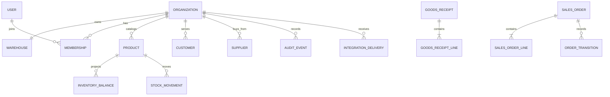

# StockPilot domain relationships

`SalesOrderLine` stores SKU, product name, and unit-price snapshots so later
catalog edits do not rewrite historical orders. `StockMovement` is append-only;
`InventoryBalance` is the projection used for fast availability checks.
